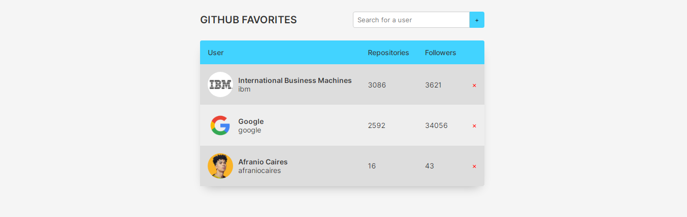

# Github Favorites

This project allows you to search for Github users and add them to your favorites list. It uses the Github API to fetch user data.

## Preview


You can preview the live version of this project hosted on GitHub Pages. This allows you to interact with the application and see its functionality in real-time.

To access the live version, navigate to the following URL:

To access the live version, click [here](https://afraniocaires.github.io/github-favorites/).

## Classes

The project consists of three main classes:

- `GithubUser`: This class is responsible for fetching user data from the Github API.
- `Favorites`: This class manages the favorites list, including adding and removing users. It also handles storing the list in the local storage.
- `FavoritesView`: This class extends `Favorites` and is responsible for the UI. It updates the view when a user is added or removed, and handles user interactions.

## Usage

To use this project, you need to create an instance of the `FavoritesView` class and pass the root element of your application as a parameter:

```javascript
const app = new FavoritesView("#app");
```

You can then use the `add` method to add a user to the favorites list:

```javascript
app.add("username");
```

And the `delete` method to remove a user:

```javascript
app.delete(user);
```

## Contributing

Contributions are welcome. Please make sure to update tests as appropriate.

## License

This project is licensed under the MIT License.
